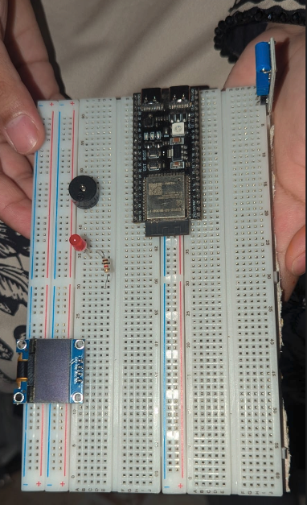
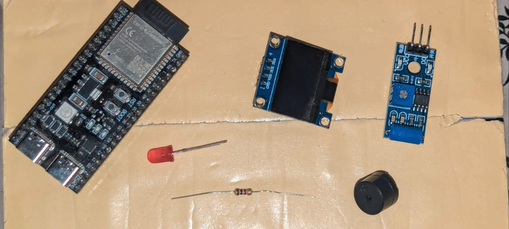
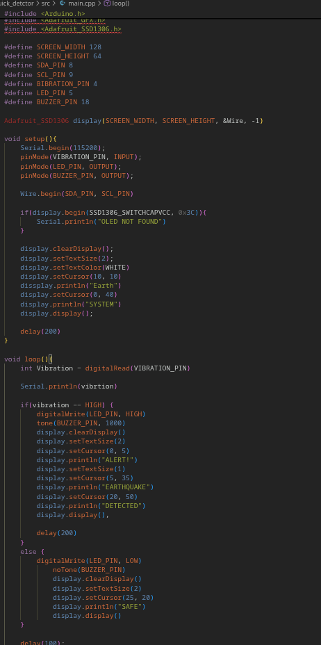
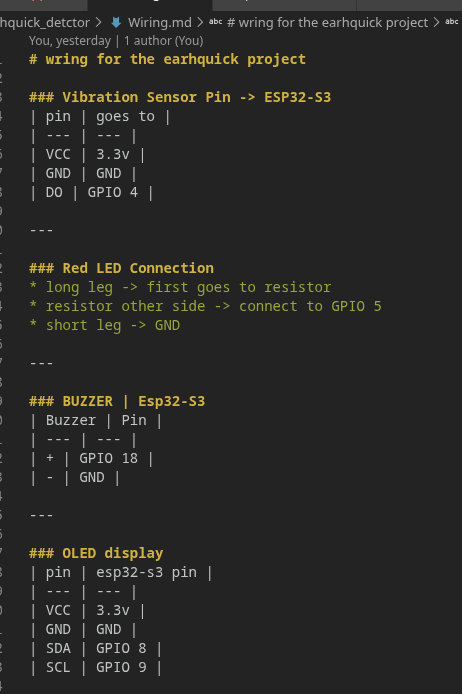
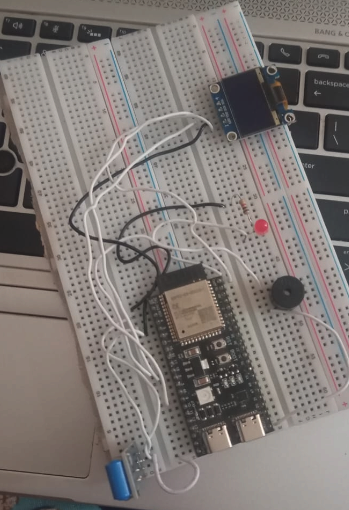
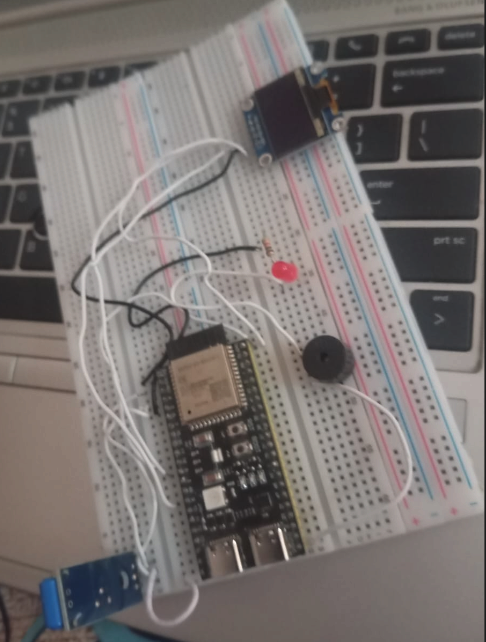
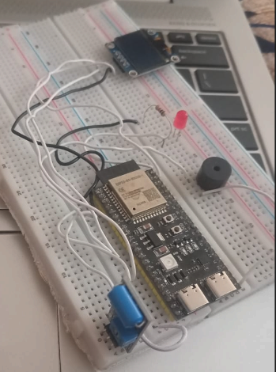
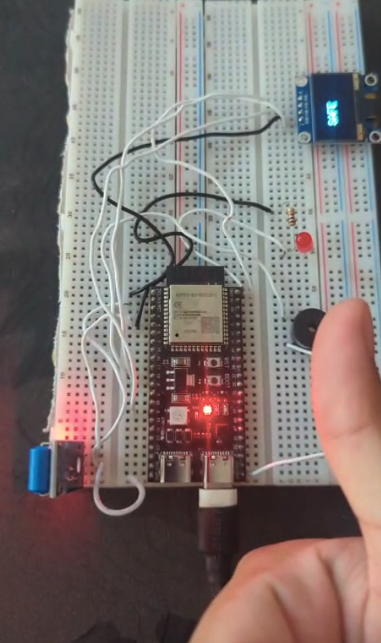
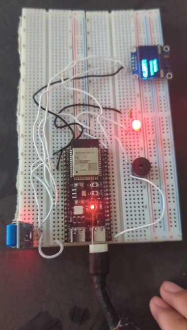
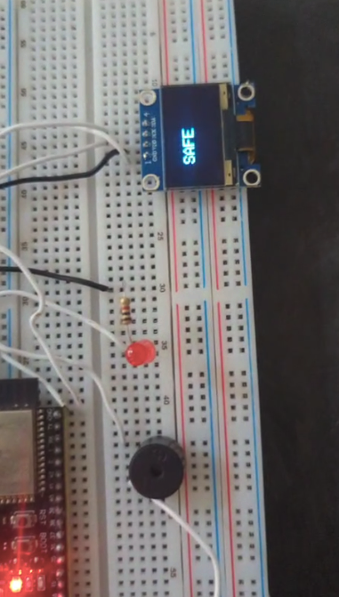

## Time : 13 minutes
Today I collect all the components which are needed in this project and also then i set them on the breadboard the components are vibration sensor which will detect the vibration, buzzer which will amek sound when there is danger , red led which will be on when there is danger, oled screen shows that is it safe or not and ESP32-S3 which is microcontroller which will control all the project and also all the code will be in esp32s3 ... i also dont know that which one is vibration sensor then i search it from google andd then find it from my modules box thats why it take time

### here is how the breadboard setup looks like right now:

### and my components are these:

---

## Time : 01:20 (one hour and 20 minues)
I write the code of my earthquick detctor in c++ and also i am using visual studio code for writing coding and using platformIO so i can push
my code into the ESP32-S3. I also rite the platform.ini

---

## 25 minutes
Today i write the all wiring of my project that which components iring will be attached to esp32s3 and other things like resistor and also
I have write it in the vs code file

### My wiring file pic:

---

## Time : 1 hour

Today I have first confirm the components then i started to wiring . first i do wrong wiring like i connect wrong pins of vibrtion sensor an also 
of oled screen after i realize that what is wrong i set them then there was another wrong little issue of buzzer i mean i wire right but in the next
pin like breadboard other pin

---

## Time : 3 minutes

After pushing the code into the esp32s3 then I tested my projct and ii am so happy to see it . It is working perfectly

### My project working video

---